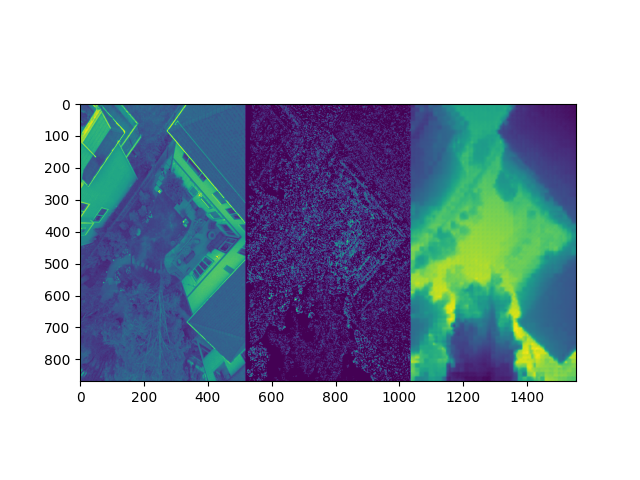

# Mono Depth Perception

This repository contains 4th place solution for 
[AICrowd Mono Depth Perception](https://www.aicrowd.com/challenges/scene-understanding-for-autonomous-drone-delivery-suadd-23/problems/mono-depth-perception) 
using the MIM and DinoV2 models.


[Blog post](https://medium.com/@tearth/my-journey-with-depth-estimation-8c53ab25cd8b)





## Run code 


## Prepare code

1. **Already done** Load MIM and DinoV2 code:

```
cd my_models 
git clone https://github.com/SwinTransformer/MIM-Depth-Estimation.git  # `59ba08d66033b9e3469f67e8c5c6f2c325398dce` commit
git clone https://github.com/facebookresearch/dinov2  # `c3c2683a13cde94d4d99f523cf4170384b00c34c` commit
```

2. Load pretrained models:

* Finetuned models - [GoogleDrive](https://drive.google.com/drive/folders/1G4VIXYej46Cf2ip0HxS2dMjeZssUEfQO?usp=sharing).

DinoV2 and MIM models weights are taken from: 

* MIM: Download the kitti_swin_base.ckpt file from [MIM](https://github.com/SwinTransformer/MIM-Depth-Estimation) - [Onrdrive](https://mailustceducn-my.sharepoint.com/:f:/g/personal/aa397601_mail_ustc_edu_cn/EkoYQyhiD6hJu9CGYLOwiF8BRqHgk8kX61NUcyfmdOUV7Q?e=h2uctw).


* DinoV2: Download the pretrained model [ViT-L/14 distilled](https://dl.fbaipublicfiles.com/dinov2/dinov2_vitl14/dinov2_vitl14_pretrain.pth) from [DinoV2](https://github.com/facebookresearch/dinov2).


Put all checkpoints to `./mono_depth_estimation_aicrowd/models/` directory.

3. Install dependencies using venv

```
virtualenv .env
source .env/bin/activate
pip install --editable .
```

or using docker:

```
docker build -t 'latest' .
```

## Training

1. Load data from [competition](https://www.aicrowd.com/challenges/scene-understanding-for-autonomous-drone-delivery-suadd-23/problems/mono-depth-perception) page and put it into `../data` folder. 

2. Run training using pre-defined split to get performance scores

```
sh scripts/train_dino_score.sh
```

or using docker:

```
docker run -v PATH_TO_TRAIN_DATA:/data \
           -v $(pwd)/mono_depth_estimation_aicrowd/models/:/work/mono_depth_estimation_aicrowd/models/ \
           --gpus 0 \
           --ipc=host \
           latest \
           sh scripts/run_train_dino_score.sh
```

3. Run training using KFold split to obtain final model:

```
sh scripts/train_dino_sub.sh
```

or using docker:

```
docker run -v PATH_TO_TRAIN_DATA:/data \
           -v $(pwd)/mono_depth_estimation_aicrowd/models/:/work/mono_depth_estimation_aicrowd/models/ \
           --gpus 0 \
           --ipc=host \
           latest \
           sh scripts/run_train_dino_sub.sh
```

## Inference

Put files into `./sample_test_data/inputs/` and run:

```
sh scripts/inference.sh
```

or using docker:

```
docker run -v $(pwd)/sample_test_data:/work/sample_test_data/ \
           --gpus 0 \
           --ipc=host \
           latest \
           sh scripts/run_inference.sh
```

## License

For this project, I fine-tuned the model using weights from DinoV2, which is licensed under the Attribution-NonCommercial 4.0 International (CC BY-NC 4.0) license, and MIM, which falls under the MIT License. Given the two licenses, the project adheres to the more restrictive one, which is the Attribution-NonCommercial 4.0 International (CC BY-NC 4.0) license.
